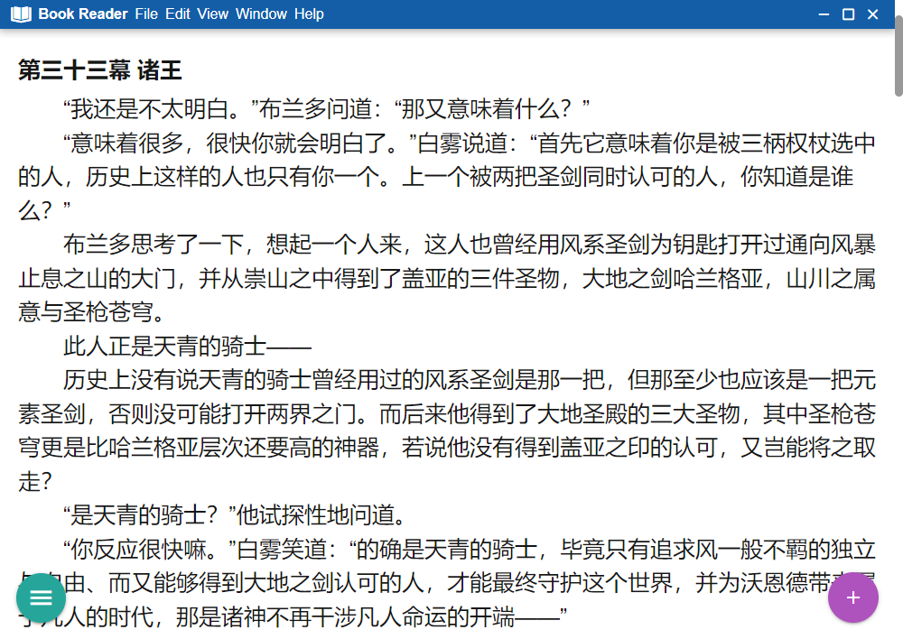

# LightReader 纯净的TXT阅读器

## 适用范围
有的时候吧，那电脑看小说的体验还是很棒的，但是市面上很多阅读器不支持TXT文件的目录生成，这就很让人难受了，偶尔遇到一两个支持目录的软件吧，他们的阅读器都有着鲜明的界面特征，我尤其缅怀那种极简的阅读体验，所以制作了这样一个简单的阅读器。

## 特性
- 💡 **目录支持**：自配置的正则表达式目录解析支持。
- ⚡ **便捷**：仅阅读功能，即开即用。
- 🦋 **优质的阅读体验**：自由设置字体大小，边距等。
- ⌨️ **快捷键支持**：左右键翻页，tab键打开目录。

## 警告
暂无

## 使用示例
没有

## 致歉

因为本人时间原因（~~高三~~），个人能力有限（~~是个废物~~）。我可能不怎么更新，欢迎大佬贡献代码。

## 最后

希望大家赏个**Star**，以满足吾辈这小小的虚荣心吧！！！

